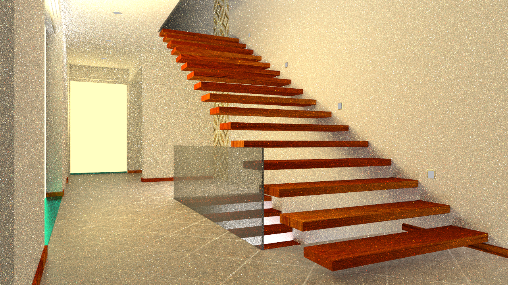
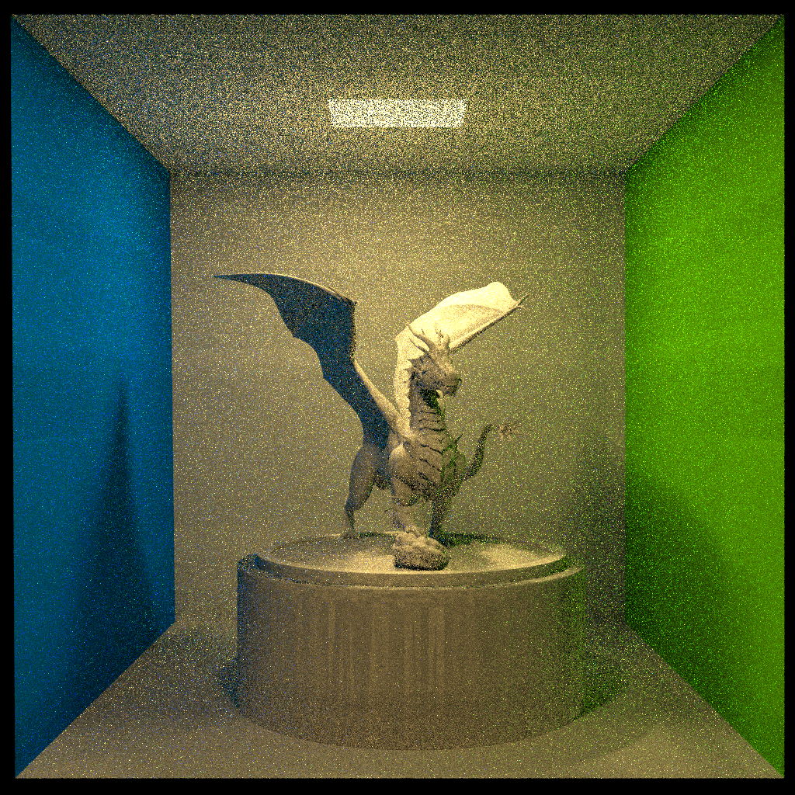

# Environments

The implementation code can be found [here](https://drive.google.com/drive/folders/1Iua5iAMI4Y5jygBS0qVenrUe1wnTJ8JB)

**System**: WIN10

**Compiler**: Visual Studio 2019

**Dependencies**: [glm](https://github.com/g-truc/glm), [opencv](https://github.com/opencv/opencv), [sol](https://github.com/ThePhD/sol2)

* The **sol** has been properly set up, but you need to configure **glm** and **opencv** in order to run it.
* Use **[vcpkg](https://github.com/microsoft/vcpkg)** for configuration. After downloading, click on the **.bat** file inside the folder, add the folder to system path, and enter the commands `vcpkg install glm` and `vcpkg install opencv:x64-windows` to install **glm** and **opencv**.
* Save the image using **[svpng](https://github.com/miloyip/svpng)**.
* The loading of **.obj** files is facilitated using **[tiny_obj_loader](https://github.com/tinyobjloader/tinyobjloader)**.

# Content

Programming implementation of the Monte Carlo Path Tracing algorithm. The detail requirements of this task are given [here](./scenes/README.md).

**Input:** Model files in **obj** format and material files in **mtl** format, with **lua** as the configuration file, setting the radiance of light sources and various attributes of the camera, etc.

**Output:** The current rendering information would be displayed in the console, and the results would be saved in the **result** folder in **.png** format when the rendering is finished.

High specular reflection, diffuse reflection, and refraction effects have been implemented.

# Run

Open **MonteCarloPathTracing.vcxproj**, run **main.cpp** in release and x64 mode, adjust the `SPP` parameter through **scene.cpp**, and save the results in the **result** folder.

# Explanation of project structures

* **BoundingBox** is a bounding box used for accelerating calculations.
* **BVH** is a structure tree of bounding boxes.
* **Camera** represents a camera, including projection type, camera position, viewing direction, upward direction, and fovy information. These information can be read from a **.lua** file.
* **DataFrame** is a data structure for storing images.
* **IntersectResult** is the result of an intersection calculation, which stores necessary data required for certain computations.
* **Light** is a class representing light sources, which stores relevant information about the light source. However, the radiance of the light source is still stored in the `Triangle` class.
* **LuaConfigParser** is used for reading **.lua** information.
* **main.h** file contains some `#define`, such as `PI`, `EPSILON`, and the probability in the Russian roulette.
* **Material** is used for storing textures and contains a built-in `isTextureFlag`, which is set to true when the texture needs to be mapped to an external file. The file name of this external file is stored in the corresponding string.
* **Obj** is used for loading **.obj** files.
* **Ray** represents a ray, which includes the starting point and direction of the ray, as well as functions for reflection and refraction.
* **Sample** represents a sampling.
* **Scene** represents a scene, which contains necessary information such as models, cameras, and light sources.
* **Shape** represents geometry and contains the `Point` class and `Triangle` class.
* **Texture** represents texture mapping.

# Acceleration instructions

* Direct lighting is used, which means before sampling, the light sources in the scene are traversed to calculate the direct illumination at intersection points. In this way, a relatively bright rendering result can be achieved with a small number of samples. Then, ray tracing is performed based on this result, which allows the rendering result to quickly converge to the realistic scene effect.
* The BVH data structure is used for acceleration. The entire scene's models are organized into a hierarchical tree structure consisting of bounding boxes. By performing simple intersection tests between rays and bounding boxes, it can be determined whether further intersection tests with the scene are necessary. This avoids performing intersection calculations for rays that do not intersect with the scene, thereby improving the efficiency of the intersection calculations that are frequently performed in path tracing algorithms. As a result, the algorithm's efficiency is significantly improved.
* Utilize [OpenMP](https://www.openmp.org/) for loop acceleration in the path tracing algorithm. In the path tracing algorithm, the ray tracing between different pixels is independent, and there are no dependencies between them, allowing for parallel computation. OpenMP provides excellent support for compiling programs into multi-core parallel code, thereby effectively utilizing the hardware resources of multi-core CPUs and achieving acceleration of the path tracing algorithm.

# Result

